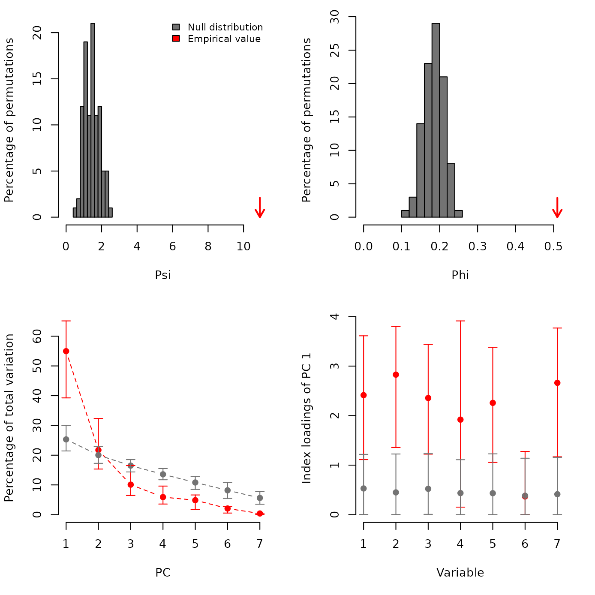

# PCAtest: Statistical significance of PCA

## Introduction

A PCA is meaningful and should only be applied if there is a significant
correlation structure among at least some of the variables in a dataset.
Due to sampling variance alone, it is possible that some level of random
correlation structure could occur in the data. Therefore, it is
necessary to evaluate if the observed correlation structure is higher
than expected due to chance alone.

PCAtest uses a pair of statistics, Psi and Phi, based on the eigenvalues
(roots) of a PCA to evaluate its significance by comparing observed
values with their null distributions. The expected values of Psi and Phi
are calculated from random permutations of the observations within
variables, which effectively removes any correlation structure among
variables. If the observed statistics are not larger than the expected
null distributions, PCA is meaningless and it should not be used.

If the null hypothesis of a non-significant PCA is rejected, then
PCAtest calculates the observed eigenvalues and builds null
distributions to select the number of significant PCs. In addition,
PCAtest also calculates two other statistics: the index of the loadings
and the correlations of each PC with the variables, to test the
contribution of the observed variables to each significant PC.

## Overall significance of a PCA

PCAtest should not reject the null hypothesis of a non-significant PCA,
if there is no correlation structure among the variables. We can
generate and analyze in PCAtest a set of uncorrelated variables:

``` r
library(PCAtest)
library(MASS)
mu <- rep(0,5)
Sigma <- matrix(c(rep(c(1,0,0,0,0,0),4),1),5)
ex0 <- mvrnorm(100, mu = mu, Sigma = Sigma )
result<-PCAtest(ex0, 100, 100, 0.05, indload=FALSE, varcorr=FALSE, counter=FALSE, plot=TRUE)
#> 
#> Sampling bootstrap replicates... Please wait
#> 
#> Calculating confidence intervals of empirical statistics... Please wait
#> 
#> Sampling random permutations... Please wait
#> 
#> Comparing empirical statistics with their null distributions... Please wait
#> 
#> ========================================================
#> Test of PCA significance: 5 variables, 100 observations
#> 100 bootstrap replicates, 100 random permutations
#> ========================================================
#> 
#> Empirical Psi = 0.2505, Max null Psi = 0.4141, Min null Psi = 0.0363, p-value = 0.15
#> Empirical Phi = 0.1119, Max null Phi = 0.1439, Min null Phi = 0.0426, p-value = 0.15
#> 
#> PCA is not significant!
```


## Selecting the number of significant PCs

If a PCA is significant, PCAtest uses random permutations to test which
PC axes are significant based on random permutation and calculation of
the percentage of total variation explained by each PC axis. We can use
the published dataset from Wong & Carmona (2021,
<https://doi.org/10.1111/2041-210X.13568>) consisting of seven
morphological variables measured in 29 ant species:

``` r
data("ants")
result<-PCAtest(ants, 100, 100, 0.05, indload=FALSE, varcorr=FALSE, counter=FALSE, plot=TRUE)
#> 
#> Sampling bootstrap replicates... Please wait
#> 
#> Calculating confidence intervals of empirical statistics... Please wait
#> 
#> Sampling random permutations... Please wait
#> 
#> Comparing empirical statistics with their null distributions... Please wait
#> 
#> ========================================================
#> Test of PCA significance: 7 variables, 29 observations
#> 100 bootstrap replicates, 100 random permutations
#> ========================================================
#> 
#> Empirical Psi = 10.9186, Max null Psi = 2.4335, Min null Psi = 0.7399, p-value = 0
#> Empirical Phi = 0.5099, Max null Phi = 0.2407, Min null Phi = 0.1327, p-value = 0
#> 
#> Empirical eigenvalue #1 = 3.84712, Max null eigenvalue = 2.20197, p-value = 0
#> Empirical eigenvalue #2 = 1.52017, Max null eigenvalue = 1.66424, p-value = 0.18
#> Empirical eigenvalue #3 = 0.70634, Max null eigenvalue = 1.38726, p-value = 1
#> Empirical eigenvalue #4 = 0.41356, Max null eigenvalue = 1.16479, p-value = 1
#> Empirical eigenvalue #5 = 0.34001, Max null eigenvalue = 0.92378, p-value = 1
#> Empirical eigenvalue #6 = 0.14515, Max null eigenvalue = 0.76744, p-value = 1
#> Empirical eigenvalue #7 = 0.02765, Max null eigenvalue = 0.53648, p-value = 1
#> 
#> PC 1 is significant and accounts for 55% (95%-CI:40-63.6) of the total variation
```


## Testing which variables have significant loadings

In addition to selecting the number of significant PC axes, we are
usually interested in finding out which variables have significant
loadings on each significant PC axis. PCAtest runs random permutations
and plots index loadings for all significant PCs:

``` r
data("ants")
result<-PCAtest(ants, 100, 100, 0.05, indload=TRUE, varcorr=FALSE, counter=FALSE, plot=TRUE)
#> 
#> Sampling bootstrap replicates... Please wait
#> 
#> Calculating confidence intervals of empirical statistics... Please wait
#> 
#> Sampling random permutations... Please wait
#> 
#> Comparing empirical statistics with their null distributions... Please wait
#> 
#> ========================================================
#> Test of PCA significance: 7 variables, 29 observations
#> 100 bootstrap replicates, 100 random permutations
#> ========================================================
#> 
#> Empirical Psi = 10.9186, Max null Psi = 2.4714, Min null Psi = 0.5735, p-value = 0
#> Empirical Phi = 0.5099, Max null Phi = 0.2426, Min null Phi = 0.1169, p-value = 0
#> 
#> Empirical eigenvalue #1 = 3.84712, Max null eigenvalue = 2.23241, p-value = 0
#> Empirical eigenvalue #2 = 1.52017, Max null eigenvalue = 1.71318, p-value = 0.11
#> Empirical eigenvalue #3 = 0.70634, Max null eigenvalue = 1.3766, p-value = 1
#> Empirical eigenvalue #4 = 0.41356, Max null eigenvalue = 1.14496, p-value = 1
#> Empirical eigenvalue #5 = 0.34001, Max null eigenvalue = 0.93756, p-value = 1
#> Empirical eigenvalue #6 = 0.14515, Max null eigenvalue = 0.7892, p-value = 1
#> Empirical eigenvalue #7 = 0.02765, Max null eigenvalue = 0.62112, p-value = 1
#> 
#> PC 1 is significant and accounts for 55% (95%-CI:39.3-65.1) of the total variation
#> 
#> Variables 1, 2, 3, 4, 5, and 7 have significant loadings on PC 1
```



## Testing which variables have significant correlations

Instead of index loadings, we can choose to use variable correlations to
evaluate their contributions to each significant PC axis:

``` r
data("ants")
result<-PCAtest(ants, 100, 100, 0.05, indload=FALSE, varcorr=TRUE, counter=FALSE, plot=FALSE)
#> 
#> Sampling bootstrap replicates... Please wait
#> 
#> Calculating confidence intervals of empirical statistics... Please wait
#> 
#> Sampling random permutations... Please wait
#> 
#> Comparing empirical statistics with their null distributions... Please wait
#> 
#> ========================================================
#> Test of PCA significance: 7 variables, 29 observations
#> 100 bootstrap replicates, 100 random permutations
#> ========================================================
#> 
#> Empirical Psi = 10.9186, Max null Psi = 2.7018, Min null Psi = 0.5938, p-value = 0
#> Empirical Phi = 0.5099, Max null Phi = 0.2536, Min null Phi = 0.1189, p-value = 0
#> 
#> Empirical eigenvalue #1 = 3.84712, Max null eigenvalue = 2.16286, p-value = 0
#> Empirical eigenvalue #2 = 1.52017, Max null eigenvalue = 1.6875, p-value = 0.23
#> Empirical eigenvalue #3 = 0.70634, Max null eigenvalue = 1.44721, p-value = 1
#> Empirical eigenvalue #4 = 0.41356, Max null eigenvalue = 1.12624, p-value = 1
#> Empirical eigenvalue #5 = 0.34001, Max null eigenvalue = 0.94865, p-value = 1
#> Empirical eigenvalue #6 = 0.14515, Max null eigenvalue = 0.75295, p-value = 1
#> Empirical eigenvalue #7 = 0.02765, Max null eigenvalue = 0.64223, p-value = 1
#> 
#> PC 1 is significant and accounts for 55% (95%-CI:44.7-66.3) of the total variation
#> 
#> Variables 2, and 3 have significant correlations with PC 1
```
